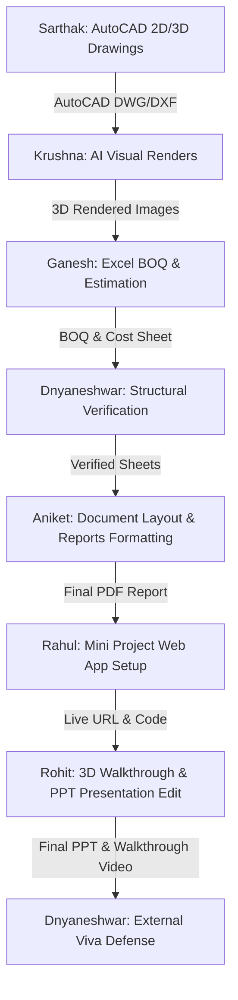

# 🌍 CIVILOS AI: THE 7 HEROES MASTERPLAN
> **Ecosystem Operating System & 8-Month Trajectory (June 2026 – January 2027)**
> **Location:** Ahilyanagar Secret Base Camp (24/7 Home Mode)

---

## 🔠 THE A-Z HEROES ROSTER & FINALIZED ROLES

| Alphabet | Hero Name | Finalized Role | Primary Focus Area |
| :---: | :--- | :--- | :--- |
| **A** | **Aniket** | **Office Workflow Expert** | Paperwork, cold client outreach, Canva designs, billing documentation |
| **D** | **Dnyaneshwar** | **Diploma + Backlog Warrior** | Clearing all MSBTE backlogs, mastering core structural mechanics |
| **G** | **Ganesh** | **Site/Billing Engineer** | Virtual quantity surveying, site measurement audits, Excel billing sheets |
| **K** | **Krushna** | **AI Civil Expert** | AI automation workflows, structural summary reporting, Midjourney visuals |
| **R1** | **Rahul** | **App Developer** | Web dashboards, Flutter mobile app, coding logic, server configurations |
| **R2** | **Rohit** | **Professional Creator** | High-contrast Reels/Shorts editing, YouTube SEO, branding showreels |
| **S** | **Sarthak** | **CAD Freelancer** | 2D architectural drawings, SketchUp 3D models, international bidding |

---

## 📅 MONTH-BY-MONTH SYSTEMATIC BLUEPRINT

### 🟢 JUNE 2026: THE FOUNDATION MONTH (No AI)
> **Goal:** Core manual grinding, building muscle memory, setting up profiles, and getting comfortable with basic tools.

* **🅰️ Aniket (Office):**
  * **Skills:** English/Marathi typing practice (10 min daily), basic document layouts in MS Word.
  * **Tasks:** Organize base camp documentation folders, type out master team schedules.
* **🅱️ Dnyaneshwar (Study):**
  * **Skills:** Algebra, Geometry, 8th & 9th Standard Maths, basic Theory of Structures (TOS) stress-strain definitions.
  * **Tasks:** Write down all formulas in a dedicated diary, solve 20 math numericals daily.
* **🅲️ Ganesh (Site):**
  * **Skills:** Basic building construction materials, reading tape measures (inches, feet, cm, mm).
  * **Tasks:** Learn standard concrete mix ratios, practice manual weight calculations for sand/cement.
* **🅳️ Krushna (AI):**
  * **Skills:** ChatGPT prompting basics, learning how to write specific, detailed instructions.
  * **Tasks:** Create text summary templates, write study guides for Dnyaneshwar's math topics.
* **🅴️ Rahul (App):**
  * **Skills:** Basic HTML tags (`<h1>`, `<p>`, `<a>`), basic CSS background colors and layout properties.
  * **Tasks:** Code a static 1-page landing page website for the team base camp.
* **🆵 Rohit (Edit):**
  * **Skills:** Canva basics, designing YouTube thumbnails, simple video cuts on mobile timelines.
  * **Tasks:** Create logo designs for "CivilOS AI", design promo posters for local business outreach.
* **🅶️ Sarthak (CAD):**
  * **Skills:** AutoCAD basic commands (Line, Offset, Trim, Circle, Erase).
  * **Tasks:** Draw simple shapes, practice drawing a 2D single-line plan layout.

---

### 🟢 JULY 2026: THE CORE FOUNDATION MONTH (No AI)
> **Goal:** Increase structural logic depth, advance to professional drawing configurations, and check in first client leads.

* **🅰️ Aniket (Office):**
  * **Skills:** Intermediate Excel sheets, formatting tables, using SUM and subtraction formulas.
  * **Tasks:** Setup a monthly budget and expenditure workbook for the base camp.
* **🅱️ Dnyaneshwar (Study):**
  * **Skills:** MSBTE TOS Syllabus Unit 1 & 2 (Direct & Bending Stresses), 10th standard Trigonometry, Physics mechanics.
  * **Tasks:** Calculate stresses on simple column structures, solve structural mock questions.
* **🅲️ Ganesh (Site):**
  * **Skills:** RCC foundation steps, brickwork masonry checks, moisture check guidelines for materials.
  * **Tasks:** Estimate cement sacks required for a simple wall structure layout.
* **🅳️ Krushna (AI):**
  * **Skills:** Advanced prompts, generating study revision tables, using AI for terminology lookups.
  * **Tasks:** Compile a booklet of civil codes and definitions using AI summaries.
* **🅴️ Rahul (App):**
  * **Skills:** JavaScript basics, handling form buttons, text box inputs, simple click actions.
  * **Tasks:** Code an interactive calculator page that estimates cement bags.
* **🆵 Rohit (Edit):**
  * **Skills:** Premiere Pro timelines, audio syncing, sound effects (SFX) layering, adding backgrounds.
  * **Tasks:** Edit a 15-second teaser clip for local businesses, sync narration to music beats.
* **🅶️ Sarthak (CAD):**
  * **Skills:** AutoCAD 2D floor plans, adding room dimensions, layout settings, scaling drawings.
  * **Tasks:** Draft a complete 2D plan of a 1BHK apartment showing walls, doors, and windows.

---

### 🟢 AUGUST 2026: RCC + CAPSTONE START (Transition Month)
> **Goal:** Initiating the official Collaborative Capstone Project, starting international bidding, and registering for winter exams.

* **🅰️ Aniket (Office):**
  * **Skills:** Excel formulas (IF, COUNTIF), layout borders, printing alignments.
  * **Tasks:** Draft a professional resume/portfolio for Sarthak to use on Upwork/Fiverr.
* **🅱️ Dnyaneshwar (Study):**
  * **Skills:** Design of Steel & RCC structures, understanding compression/tension zones.
  * **Tasks:** MSBTE Winter Exam Form filling (Normal Fees deadline), sketch reinforcement profiles.
* **🅲️ Ganesh (Site):**
  * **Skills:** Bar Bending Schedule (BBS) formulas ($D^2/162$), steel weight calculations.
  * **Tasks:** Create a billing spreadsheet template for bar reinforcement counting.
* **🅳️ Krushna (AI):**
  * **Skills:** AI generated reports, using AI calculators for material counts, prompts constraints.
  * **Tasks:** Draft the intro and literature review outline for the Capstone Project report.
* **🅴️ Rahul (App):**
  * **Skills:** Flutter SDK installation, dart language basics, coding simple container layouts.
  * **Tasks:** Set up the Android emulator, run a "Hello World" app on a physical phone.
* **🆵 Rohit (Edit):**
  * **Skills:** Motion graphics, animated subtitle captions, keyframing zooms in Premiere Pro.
  * **Tasks:** Create viral reels hook styles, study pacing benchmarks of top media editors.
* **🅶️ Sarthak (CAD):**
  * **Skills:** Creating working drawings, sections, elevations, layer management.
  * **Tasks:** Import a 2D CAD plan into SketchUp, extrude 3D walls to a standard height of 10 feet.

---

### 🔵 SEPTEMBER 2026: AI INJECTION & VOLUME
> **Goal:** 100% integration of AI tools, launching services, generating passive assets, and heavy study volume.

* **🅰️ Aniket (Office):**
  * **Skills:** Canva presentations, business proposal designs, cold email drafting.
  * **Tasks:** Pitch digital marketing flyer retainers to local shop owners in Pune.
* **🅱️ Dnyaneshwar (Study):**
  * **Skills:** Public Health Engineering (PHE) water systems, Maintenance & Repair basics.
  * **Tasks:** Solve 5-year MSBTE previous year papers (PYQs) for TOS using ChatGPT translations.
* **🅲️ Ganesh (Site):**
  * **Skills:** Billing protocols, Daily Progress Reports (DPR), sub-contractor calculations.
  * **Tasks:** Compile daily progressive sheets and verify material invoices.
* **🅳️ Krushna (AI):**
  * **Skills:** Midjourney photorealistic architecture prompts, generative visuals.
  * **Tasks:** Generate 3D interior design mockups to support Sarthak's Upwork pitches.
* **🅴️ Rahul (App):**
  * **Skills:** Firebase setup, user authentication (Login/Signup fields), simple data synchronization.
  * **Tasks:** Connect a cloud database to the Flutter dashboard, test login forms.
* **🆵 Rohit (Edit):**
  * **Skills:** RunwayML video generation, background object removals, color grading with LUTs.
  * **Tasks:** Edit high-retention video shorts, schedule uploads on YouTube Shorts/TikTok.
* **🅶️ Sarthak (CAD):**
  * **Skills:** SketchUp shadows, light presets, Vastu compliance layouts.
  * **Tasks:** Deliver the final 2D/3D Vastu elevations to Upwork clients, log first dollar earnings.

---

### 🔵 OCTOBER 2026: THE PRACTICAL GRIND & JUMP
> **Goal:** Preparing practical exam journals, viva checkouts, capstone final submission, and peak stress management.

* **🅰️ Aniket (Office):**
  * **Skills:** Document conversion, PDF printing bleed margins, invoice archives.
  * **Tasks:** Compile and bind Dnyaneshwar's structural journals, format Capstone files.
* **🅱️ Dnyaneshwar (Study):**
  * **Skills:** Contracts & Accounts systems, viva oral questions prep.
  * **Tasks:** Practical Exams submission (Starts 21st Oct). Complete mock viva testing with team.
* **🅲️ Ganesh (Site):**
  * **Skills:** Site measurements audits, verification checks on concrete pours.
  * **Tasks:** Check reinforcing steel spacing limits physically, log audit sheets.
* **🅳️ Krushna (AI):**
  * **Skills:** ChatPDF structural codes analysis, AI oral checkups.
  * **Tasks:** Quiz Dnyaneshwar using AI-generated viva checklists based on IS 456 rules.
* **🅴️ Rahul (App):**
  * **Skills:** Flutter ListView builder layouts, dynamic lists scrolling.
  * **Tasks:** Code a fully scrollable inventory tracker app, verify release APK build.
* **🆵 Rohit (Edit):**
  * **Skills:** After Effects motion templates, transition velocity adjustments.
  * **Tasks:** Assemble the final team showreel showcase, add vocal narration overlays.
* **🅶️ Sarthak (CAD):**
  * **Skills:** Plotting blueprints to scale, layout window spacing check.
  * **Tasks:** Deliver 3D renders on active Fiverr gigs, update portfolio database.

---

### 🔴 NOVEMBER 2026: THE THEORY EXAM WAR
> **Goal:** Ultimate focus on MSBTE Theory exams for Dnyaneshwar, while the remaining 6 heroes run automated gigs to secure record group revenue.

* **🅰️ Aniket (Office):**
  * **Skills:** Professional report compiling, Excel database exports.
  * **Tasks:** Maintain clients logs, manage team finances, compile invoice files.
* **🅱️ Dnyaneshwar (Study):**
  * **Skills:** Solid Waste Management (SWM), Emerging Trends in Civil, Entrepreneurship.
  * **Tasks:** Theory Exams (17th Nov – 9th Dec). 100% study isolation. Zero sutti!
* **🅲️ Ganesh (Site):**
  * **Skills:** Quantity auditing, re-checking billing formulas from past reports.
  * **Tasks:** Manage site supervision workloads for local builders.
* **🅳️ Krushna (AI):**
  * **Skills:** Generating quick summaries, using AI tool matrices for automation.
  * **Tasks:** Deliver daily automated civil design reports to active retainers.
* **🅴️ Rahul (App):**
  * **Skills:** App debugging console, Stacktrace logs reading, resolve RSOD (Red Screen).
  * **Tasks:** Test and optimize app performance, push custom patches.
* **🆵 Rohit (Edit):**
  * **Skills:** Multi-track cinematic editing, sound level optimization, voice cloning.
  * **Tasks:** Produce premium reels for local brands on monthly contracts.
* **🅶️ Sarthak (CAD):**
  * **Skills:** Fast layout editing shortcuts, technical drawings compilation.
  * **Tasks:** Execute bulk 2D drafting orders under tight deadlines, scale freelancing.

---

### 🔴 DECEMBER 2026: THE PORTFOLIO & AUDIT MONTH
> **Goal:** Post-exam reset, finishing Capstone submissions, compiling portfolios, and closing the year-end gaps.

* **🅰️ Aniket (Office):**
  * **Skills:** Premium resume layouts, portfolio booklet formatting.
  * **Tasks:** Design the ultimate professional job application documents for the team.
* **🅱️ Dnyaneshwar (Study):**
  * **Skills:** Hands-on AutoCAD practice, estimation software inputs.
  * **Tasks:** Draft the final Capstone project drawings, compile case studies data.
* **🅲️ Ganesh (Site):**
  * **Skills:** Final site handovers documentation, cost comparison analysis.
  * **Tasks:** Compile physical site records into digital Excel archives.
* **🅳️ Krushna (AI):**
  * **Skills:** AI design assets generation, PromptBase catalog setups.
  * **Tasks:** Package and upload the team's custom prompts playbook for sale online.
* **🅴️ Rahul (App):**
  * **Skills:** Deploying apps to Google Play Store, managing backend settings.
  * **Tasks:** Launch the finalized CivilOS utility app, track initial user logs.
* **🆵 Rohit (Edit):**
  * **Skills:** Premiere cache database cleaning, portfolio showreels.
  * **Tasks:** Publish the team's 8-month transformation case study video.
* **🅶️ Sarthak (CAD):**
  * **Skills:** Intermediate structural detailing, custom furniture blocks.
  * **Tasks:** Build high-value SketchUp models for commercial portfolio.

---

### 🔴 JANUARY 2027: THE FINISH LINE (JEET)
> **Goal:** Clearing all outstanding client balances, final results check, scaling operations, and hitting the ₹7 Lakh target.

* **🅰️ Aniket (Office):**
  * **Skills:** Final accounts auditing, ledger balancing.
  * **Tasks:** Clear all pending client invoices, verify base camp finances.
* **🅱️ Dnyaneshwar (Study):**
  * **Skills:** Interview presentation, civil site engineering confidence.
  * **Tasks:** MSBTE results check online, prepare for professional junior engineer interviews.
* **🅲️ Ganesh (Site):**
  * **Skills:** Junior site engineer leadership benchmarks.
  * **Tasks:** Lock in long-term junior billing/estimation engineer contracts.
* **🅳️ Krushna (AI):**
  * **Skills:** AI integration consulting, generative civil pipelines.
  * **Tasks:** Present the AI-Civil workflow model to local builder boards.
* **🅴️ Rahul (App):**
  * **Skills:** Web app scalability adjustments, client handovers.
  * **Tasks:** Deliver finalized coding assets to buyers, close tech contracts.
* **🆵 Rohit (Edit):**
  * **Skills:** YouTube channel monetization activation, AdSense setups.
  * **Tasks:** Activate video revenue models, settle showreels portfolios.
* **🅶️ Sarthak (CAD):**
  * **Skills:** Stable freelance system operations.
  * **Tasks:** Finalize contract retainers with overseas design clients.

---

## 🧠 COLLABORATIVE CAPSTONE PROJECT WORKFLOW
> **Project Title:** *"Planning, Estimation & BOQ of 2BHK Residential Building with Rainwater Harvesting System."*



---

## 🕓 DYNAMIC DAILY OS TIMETABLE
*Strict Ahilyanagar Base Camp Schedule (Mon – Sat)*

```
🌅 5:00 AM          | Wake Up
🏃 5:00 - 5:30 AM    | Hydration + Deep Stretching Exercises
📚 5:30 - 7:30 AM    | Deep Study Blocks (Hard subjects / TOS / RCC / Math)
🍛 7:30 - 8:30 AM    | Healthy Breakfast & Day Alignment Meeting
💻 9:00 - 12:00 PM   | Software Practice Block (AutoCAD / Excel / Flutter / Premiere)
🍱 12:00 - 1:00 PM   | Lunch & 20-minute Power Nap
🛠️ 1:00 - 4:00 PM    | Project Execution (Client work / Capstone assembly)
☕ 4:00 - 5:00 PM    | Team Evening Break & Walking Outdoors
🌙 5:00 - 7:00 PM    | Freelancing & Upwork Bidding / Marketing Gigs
🍽️ 7:00 - 8:00 PM    | Dinner & Relax Session
🤖 8:00 - 9:00 PM    | AI Systems Learning & Code Debugging
🔁 9:00 - 10:00 PM   | Daily Review, Log progress (+100 XP), Tomorrow's Plan
😴 10:30 PM          | Deep Sleep Recovery
```

---

## 💰 REALISTIC REVENUE TARGETS STAGES

| Phase | Months | Monthly Target (Group Cumulative) | Earning Focus |
| :---: | :--- | :--- | :--- |
| **Phase 1** | June – July | **₹0 – ₹5,000** | Small local design edits, poster making, basic typing |
| **Phase 2** | August – September | **₹10,000 – ₹20,000** | AutoCAD blueprints drafting, reels editing packages |
| **Phase 3** | October – November | **₹20,000 – ₹60,000** | 3D rendering visuals, custom App/Web development |
| **Phase 4** | December – January | **₹80,000 – ₹1,500,000+** | Multi-channel retainer clients, high-value visual showreels |

> [!IMPORTANT]
> **Total Target Milestone:** **₹7,00,000** cumulative bank balances by **January 31, 2027**.

---

## 🛡️ FINAL ECOSYSTEM TEAM MANTRA
1. **Dnyaneshwar (D):** Clear Exams ➔ 100% Target focus. No stress.
2. **Aniket (A):** Settle administrative files ➔ Secure paperwork.
3. **Ganesh (G):** Excel sheet layouts ➔ Settle exact pricing coordinates.
4. **Krushna (K):** Direct AI workflows ➔ Accelerate output speed.
5. **Rahul (R1):** Maintain server connections ➔ Code robust interfaces.
6. **Rohit (R2):** Visual pacing ➔ Produce premium video deliverables.
7. **Sarthak (S):** Architectural precision ➔ Draw clean lines.

**Consistency wins over random motivation. Today is Day 1. Start execution.** 🚀🔥
